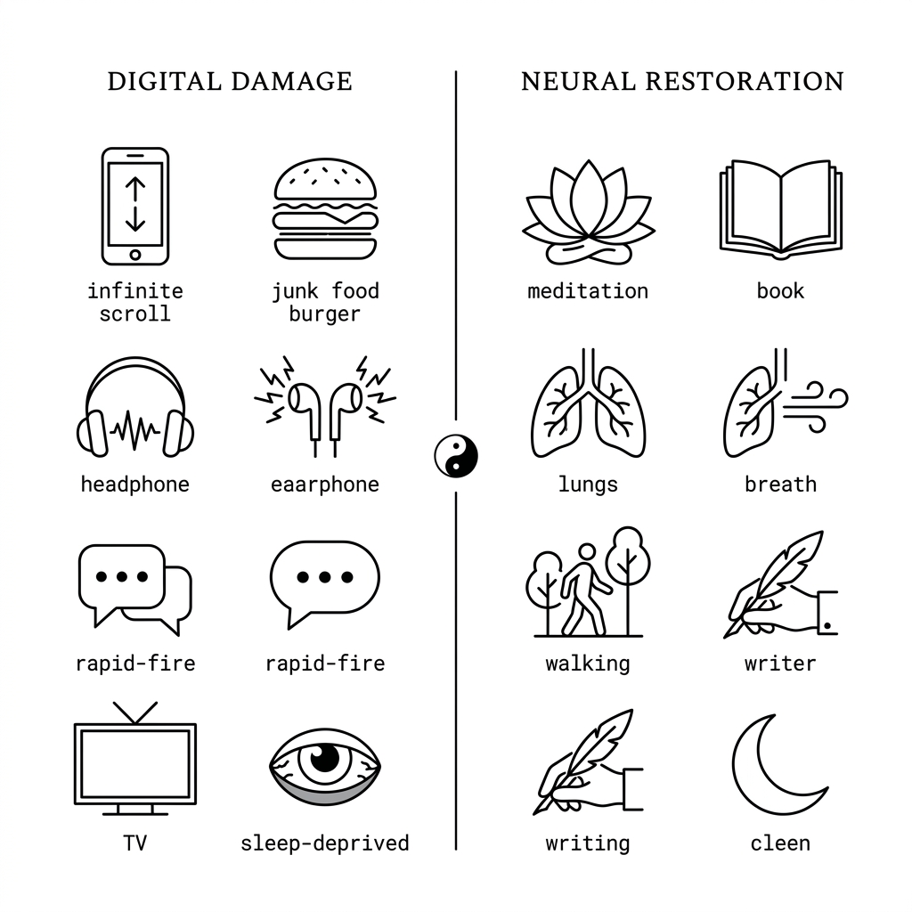
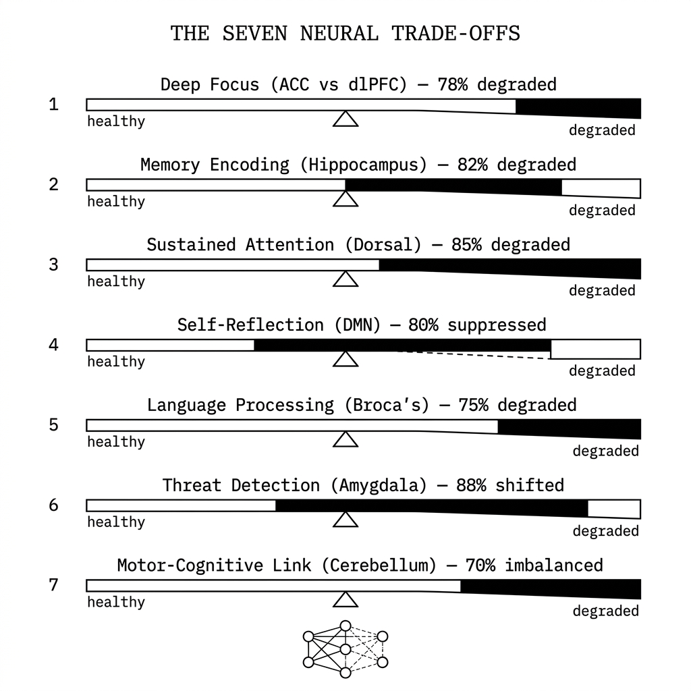

<p align="center">
  
</p>

<h1 align="center">Antahkarana</h1>

<p align="center">
  <strong>अन्तःकरण — The Inner Instrument</strong><br/>
  <em>A cognitive restoration platform grounded in Vedic neuroscience and modern behavioural research.</em>
</p>

<p align="center">
  <a href="https://antahkarana-cure-to-brain-rot.vercel.app"></a>
  
  
  
  
  
  
</p>

---

## The Problem

Between 2004 and 2024, the average human sustained attention span declined from **2.5 minutes to 65 seconds** (Mark et al., 2016). This is not a metaphor — it is a measurable, structural change in the brain.

Diffusion Tensor MRI studies reveal **measurable thinning of the dorsolateral prefrontal cortex (dlPFC)** in heavy digital users, accompanied by a **35% reduction in impulse-control capacity** as measured by EEG beta-wave variability (Loh & Kanai, 2014; Uncapher & Wagner, 2018). The anterior cingulate cortex (ACC), optimised for rapid task-switching, now dominates over the dlPFC — the seat of deep reasoning, long-term planning, and impulse control.

### The Seven Neural Trade-Offs

<p align="center">
  
</p>

| # | Neural Trade-Off | Degradation | Vedic Parallel |
|---|---|---|---|
| 1 | **ACC vs dlPFC** — Deep Focus | 78% shift toward rapid-classification over deep reasoning | *Manas* overtaking *Buddhi* |
| 2 | **Transactive Memory** — Deep Encoding | 82% shift — hippocampus stores *where* to find info, not the info itself | *Chitta* filling with metadata |
| 3 | **Ventral vs Dorsal Attention** | 85% shift — silence feels physically uncomfortable | *Indriya-dosha* — senses pulled outward |
| 4 | **Default Mode Network** — Suppressed | 80% suppression — self-reflection, identity formation degraded | *Ahamkara* without anchor |
| 5 | **Language vs Visual Networks** | 75% shift — "I cannot read long articles anymore" has an MRI explanation | *Vak-shakti* degraded |
| 6 | **Social vs Physical Threat Detection** | 88% shift — the safest generation is the most anxious | *Bhaya* — chronic fear state |
| 7 | **Cognitive Prediction vs Motor Skill** | 70% imbalance — children on tablets show weaker grip strength | *Karma Yoga* neglected |

These seven trade-offs are not independent. They compound. A person with suppressed DMN, degraded language processing, and hyperactive threat detection does not simply "focus less" — they lose the capacity for self-directed thought.

### The Hypothesis

The same **neuroplasticity** responsible for this degradation can be leveraged for restoration. Research from **IISc Bangalore** (2026), **SVYASA University**, and **Harvard Medical School** confirms that structured meditation, deep reading, and controlled breathing produce measurable increases in grey matter density, gamma-band coherence, and prefrontal cortical thickness within **8–12 weeks**.

Antahkarana operationalises these findings into a **mobile-first daily practice system**.

---

## What Antahkarana Does

### 🪔 Core Daily Loop & Onboarding
A problem-first, 3-screen onboarding journey guides new users into the application's central nervous system: the **"Today's Sadhana" Core Loop**. This dashboard hero pinned section cuts through feature fatigue, offering a clear, 3-practice, 5-minute daily ritual that serves as the entry point for all users.

### 🧘 Structured Daily Practices
Nine evidence-backed habits — each mapped to a specific neural trade-off with cited neuroscience research:

| Practice | Duration | Target Neural System | Source |
|---|---|---|---|
| Silent Meditation | 20 min | DMN reactivation, gamma coherence | IISc Bangalore (2026) |
| Deep Reading | 1 hr | Language networks, PFC connectivity | Berns et al. (2013) |
| Pranayama | 15 min | Amygdala regulation, HRV sync | Stanford Medicine, SVYASA |
| Phoneless Walk | 45 min | Locus coeruleus tonic firing | Erickson et al. (2011) |
| Naam Jap | 10 min | Hippocampal grey matter, ACC reset | Hartzell, Scientific American |
| Hand Work | 20 min | Cerebellar-prefrontal connectivity | SVYASA Psychology Lab |
| Unreachable Hour | 1 hr | DMN recovery threshold | Raichle et al. |
| Handwriting | 15 min | Deep hippocampal encoding | The Sanskrit Effect |
| Sleep Before Midnight | 7–9 hrs | Glymphatic clearance, PFC metabolism | Walker (2017), NIH |

### 🧠 Interactive Brain Map
An anatomically-aligned SVG brain visualisation with labelled regions — **Prefrontal Cortex**, **Hippocampus**, **Amygdala**, **ACC**, **Broca's Area**, **Cerebellum** — each expandable to show how digital overstimulation affects that specific region and what practice reverses it.

### 📊 Cognitive Restoration Tracker
Real-time progress visualisation across all seven neural trade-off dimensions, with percentage-based restoration scores updated as practices are completed.

### 🔥 Streak & Milestone Engine
Daily habit tracking with consecutive-day streak logic, a calendar heatmap, and eight milestone achievements — from *First Step* (1 task) to *The Quiet Inheritor* (30-day streak).

### 📜 Anti-Scroll Wisdom Feed
Full-screen cards with scroll-snap behaviour presenting Vedic teachings one at a time — with original Sanskrit, English translation, and source citation. No infinite feed. No algorithmic manipulation.

### ⏳ "Time of Void" Transitions
A 1.8-second mandala animation with rotating Vedic wisdom appears between every screen navigation — deliberately slowing the user's interaction to counteract compulsive tapping patterns.

### 📈 1000-Year Cognitive Timeline
Information processing rates from **1000 CE to 2024 CE** visualised across 12 historical eras, with expandable descriptions of how each technology shift reshaped neural architecture.

### 🌍 Global Cognitive Spectrum
OECD PIAAC-calibrated assessment of 8.1 billion humans across five cognitive processing tiers — from *Deep Thinkers* (1.2%, 320+ bits/sec) to *Cognitively Atrophied* (27%, <30 bits/sec).

### 🎶 Vedic Chants Player
A built-in, cross-platform audio engine featuring 18 curated mantras grouped by duration (5, 10, and 15 minutes). Designed with a spinning vinyl UI, progress tracking, and ambient fallback integration.

### 🧹 Digital Detox Planner
Guided screen-time reduction protocols with intention-setting prompts, incremental digital fasting schedules, and awareness exercises drawn from Pratyahara (withdrawal of senses). Tracks daily phone-free windows and escalates across a structured programme.

### 📓 Reflective Journal
Mood-tagged, timestamped journal entries stored locally in Zustand (and synced to Supabase for authenticated users). Supports free-form reflection after each practice session, with word-count statistics and a searchable entry history.

---

## Technology Stack

| Layer | Technology | Purpose |
|---|---|---|
| **Framework** | Next.js 16.2.4 (App Router) | Server-side rendering, file-based routing, middleware |
| **Language** | TypeScript 5.x | Full-stack type safety |
| **UI Library** | React 19.2 | Component architecture with Server Components |
| **Authentication** | Supabase Auth (`@supabase/ssr`) | Email/password + Google OAuth with SSR cookie sessions |
| **Database** | Supabase (PostgreSQL) | User profiles, habit logs, streak persistence (`user_progress` table) |
| **State** | Zustand 5 + persist middleware | Client-side state with localStorage hydration + cloud sync |
| **Styling** | Vanilla CSS + custom design tokens | Vedic-inspired design system — zero external UI libraries |
| **Typography** | Google Fonts (Cormorant Garamond, DM Sans, DM Mono, Noto Serif Devanagari) | Multi-script rendering for English and Sanskrit |
| **PWA & Device** | `@ducanh2912/next-pwa` + WakeLock API | Offline capability, home screen install, native-like UX, and iOS screen-sleep prevention during meditation |
| **Audio** | Web Audio API + HTML5 Audio | Meditation timer with synthesised bell fallback |
| **Analytics** | Vercel Analytics + Speed Insights | Privacy-respecting performance analytics and Core Web Vitals |
| **Hosting** | Vercel | Edge deployment with automatic SSL, global CDN |

---

## Architecture

```
src/
├── app/
│   ├── page.tsx                    # Gateway — progressive disclosure onboarding
│   ├── layout.tsx                  # Root layout — font loading, metadata, analytics
│   ├── globals.css                 # Design system — tokens, components, 3000+ lines
│   ├── icon.tsx                    # Programmatic app icon (Next.js ImageResponse)
│   ├── apple-icon.tsx              # Apple touch icon (Next.js ImageResponse)
│   ├── global-error.tsx            # Root-level error boundary
│   ├── auth/callback/              # OAuth callback handler (Google)
│   └── (app)/                      # Protected route group
│       ├── layout.tsx              # App shell — persistent bottom navigation
│       ├── loading.tsx             # Route-level loading skeleton
│       ├── error.tsx               # Route-level error boundary
│       ├── dashboard/
│       │   ├── page.tsx            # Home — core daily loop, habit cards, streak
│       │   └── dashboard.css       # Modularized styles for the sanctuary dashboard
│       ├── practice/page.tsx       # Timer sessions, habit completion logging
│       ├── wisdom/page.tsx         # Anti-scroll feed — Sanskrit with translations
│       ├── science/page.tsx        # Research — brain map, timeline, tabbed sections
│       ├── chants/page.tsx         # Audio player — 18 curated Vedic mantras & soundscapes
│       ├── profile/page.tsx        # Progress visualisation, milestones (via TopBar)
│       ├── detox/page.tsx          # Digital detox planner — screen-time reduction protocols
│       └── journal/page.tsx        # Reflective journal — mood-tagged, timestamped entries
├── components/
│   ├── BottomNav.tsx               # Navigation with "Time of Void" transition overlay
│   ├── TopBar.tsx                  # Status bar — user greeting, profile access
│   └── ClickHand.tsx               # Animated tap-indicator for first-use onboarding hints
├── data/
│   └── content.ts                  # Modular content repository — all habits, wisdoms,
│                                   #   trade-offs, eras, tiers, timer sessions, milestones
├── lib/
│   ├── audio.ts                    # Hybrid audio engine (file + WebAudio synthesis)
│   ├── sync.ts                     # Debounced cloud sync (push/pull Zustand ↔ Supabase)
│   └── supabase/
│       ├── client.ts               # Browser-side Supabase client
│       └── server.ts               # Server-side Supabase client (cookie-based sessions)
├── store/
│   └── useStore.ts                 # Zustand store — streaks, habits, timer, journal, sync
└── middleware.ts                   # Route protection — auth + guest mode bypass
```

### Authentication Flow

```
New User → Gateway (page.tsx)
  ├── "Begin the Journey" → Guest Mode (cookie: guest_mode=true) → Dashboard
  ├── Google OAuth → /auth/callback → Dashboard
  └── Email/Password → Supabase Auth → Dashboard

Guest Mode:
  ├── Full app access with localStorage persistence
  ├── Profile page shows "Create Account" prompt to sync progress
  └── Middleware allows all protected routes when guest_mode cookie exists

Protected routes: /dashboard  /practice  /wisdom  /science
                  /profile    /chants    /detox   /journal

Returning User → Middleware detects session → auto-redirect to Dashboard
```

### State Management

```
Zustand Store (persisted to localStorage as 'ank_f', modularized into domain slices)
  ├── HabitSlice
  │   ├── done[]              — completed habit IDs for today
  │   ├── streak              — consecutive practice days
  │   ├── totalTasks          — lifetime completed habits
  │   ├── totalMins           — lifetime practice minutes
  │   ├── restored[7]         — neural trade-off restoration scores (0–100%)
  │   ├── hist[]              — daily practice calendar heatmap data
  │   └── readMins, medMins, pranaMins — milestone tracking
  ├── JournalSlice
  │   └── journal[]           — JournalEntry[] { id, text, mood, date, words }
  ├── UiSlice
  │   ├── userName            — display name (default: "Seeker")
  │   └── hasSeenHabitHint    — first-use onboarding hint state
  └── SyncSlice
      └── syncStatus, lastSyncAt, syncError — topbar sync status indicator state

Cloud Sync & Database Migrations:
  ├── Supabase Schema         — `supabase/migrations/001_content_schema.sql` (Public RLS)
  ├── pushStateToCloud()      — debounced upsert to Supabase `user_progress`
  └── pullStateFromCloud() — on login, merges server state into Zustand
```

---

## Getting Started

### Prerequisites

- **Node.js 18+** and npm
- A free [Supabase](https://supabase.com) account

### Installation

```bash
git clone https://github.com/tejastarun007/Antahkarana-Cure-to-Brain-Rot.git
cd Antahkarana-Cure-to-Brain-Rot
npm install
```

### Environment Variables

Create a `.env.local` file in the project root:

```env
NEXT_PUBLIC_SUPABASE_URL=https://your-project.supabase.co
NEXT_PUBLIC_SUPABASE_ANON_KEY=your-anon-public-key
```

Find these values in your Supabase Dashboard → **Settings → API**.

### Running Locally

```bash
npm run dev
```

Open `http://localhost:3000`. Guest mode works immediately — no Supabase configuration required for exploration.

### Building for Production

```bash
npm run build
npm start
```

---

## Deployment

Optimised for [Vercel](https://vercel.com):

1. Push repository to GitHub
2. Import on Vercel
3. Add environment variables (`NEXT_PUBLIC_SUPABASE_URL`, `NEXT_PUBLIC_SUPABASE_ANON_KEY`)
4. Deploy — Vercel auto-detects Next.js, handles builds, provides SSL and global CDN

### Post-Deployment

Update in your Supabase Dashboard:

- **Authentication → URL Configuration → Site URL**: Your production domain
- **Authentication → URL Configuration → Redirect URLs**: `https://yourdomain.com/**`
- **Authentication → Providers → Google**: Enable and configure OAuth credentials

---

## Research References

| Domain | Citation |
|---|---|
| Attention span decline | Mark, G., Gudith, D., & Klocke, U. (2016). *The Cost of Interrupted Work*. CHI Conference. |
| Prefrontal cortex thinning | Loh, K. K., & Kanai, R. (2014). *Higher Media Multi-Tasking Activity Is Associated with Smaller Gray-Matter Density in the ACC*. PLoS ONE. |
| Media multitasking deficits | Uncapher, M. R., & Wagner, A. D. (2018). *Minds and Brains of Media Multitaskers*. PNAS. |
| Meditation & gamma activity | IISc Centre for Neuroscience, Bangalore (2026). *Long-term Meditation and Neural Coherence*. |
| Sanskrit & cortical density | Hartzell, J. F. et al. (2018). *The Sanskrit Effect*. Scientific American. |
| Sleep & cognitive restoration | Walker, M. (2017). *Why We Sleep*. Penguin Books. |
| Information processing evolution | Hilbert, M., & López, P. (2011). *The World's Technological Capacity*. Science, 332(6025). |
| Smartphone cognitive drain | Ward, A. F. et al. (2017). *Brain Drain*. Journal of the Association for Consumer Research. |
| Global literacy & cognition | OECD PIAAC (2023). *Survey of Adult Skills*. 39 countries, 250,000 participants. |
| Pranayama & fNIRS | SVYASA University (2024). *Functional Near-Infrared Spectroscopy Studies on Yogic Breathing*. |
| Hippocampal neurogenesis | Erickson, K. I. et al. (2011). *Exercise Training Increases Size of Hippocampus*. PNAS. |
| Novel reading & connectivity | Berns, G. S. et al. (2013). *Short- and Long-Term Effects of a Novel on Connectivity in the Brain*. Brain Connectivity. |

---

## UX Philosophy

Antahkarana is designed to be the **opposite of every engagement-optimised app**:

- **No infinite scroll** — every content section is finite and intentionally paced
- **No notifications** — the app never pulls you back
- **No gamification loops** — streaks exist for self-accountability, not dopamine exploitation
- **Deliberate friction** — the 1.8s transition between screens is intentional, not a performance issue
- **Guest-first onboarding** — explore everything before creating an account; no gates, no paywalls
- **Sanskrit as interface language** — not decoration, but a deliberate cognitive re-patterning tool (Hartzell, 2018)

---

## Contributing

Contributions are welcome. All pull requests must:

1. Follow the existing vanilla CSS design token system — no external CSS frameworks or UI libraries
2. Include proper TypeScript types for all new components and utilities
3. Preserve the intentional, non-instant-gratification UX philosophy
4. Cite peer-reviewed sources for any new neuroscience claims
5. Test on mobile viewports (primary target: 390×844)

---

## License

This project is licensed under the MIT License. See [LICENSE](LICENSE) for details.

---

<p align="center">
  <em>लोकाः समस्ताः सुखिनो भवन्तु</em><br/>
  <sub>May all beings everywhere be happy and free.</sub>
</p>
